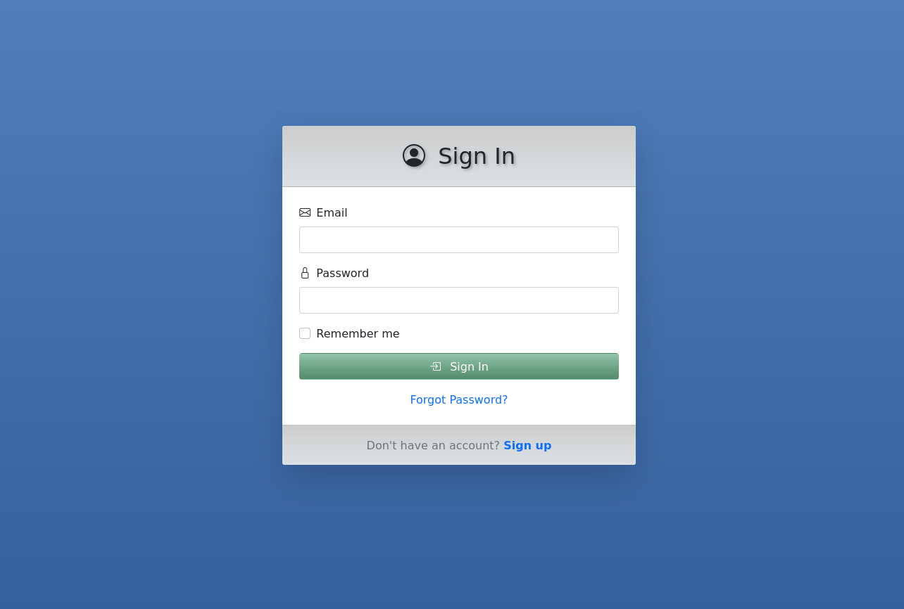

# Manager Platform

A modern, responsive task management platform built with Django and Bootstrap. Organize your projects and tasks efficiently with a clean, intuitive interface.

## 🚀 Features

### Core Functionality
- **User Authentication**: Secure login/signup system using django-allauth
- **Project Management**: Create, edit, and delete project lists
- **Task Organization**: Organize tasks within projects
- **Responsive Design**: Works seamlessly on desktop, tablet, and mobile devices
- **Real-time Updates**: HTMX-powered dynamic content updates
- **Modern UI**: Beautiful gradient design with Bootstrap 5

### User Experience
- **Intuitive Dashboard**: Clean overview of all your projects
- **Quick Actions**: Add new projects with a floating action button
- **Visual Feedback**: Smooth animations and transitions
- **Accessibility**: Keyboard navigation and screen reader support

## 🛠️ Technology Stack

- **Backend**: Django 5.2.5
- **Frontend**: Bootstrap 5, HTMX
- **Authentication**: django-allauth
- **Database**: SQLite (development), PostgreSQL (production ready)
- **Package Manager**: UV (Python package manager)
- **Styling**: Custom CSS with gradient themes
- **Icons**: Bootstrap Icons

## 📋 Prerequisites

### For Docker (Recommended)
- Docker
- Docker Compose
- Git

### For Local Development
- Python 3.13+
- UV package manager
- Git

## 🚀 Installation & Setup

### Option 1: Docker (Recommended)

#### 1. Clone the Repository

```bash
git clone <repository-url>
cd ManagerPlatform
```

#### 2. Start with Docker Compose

```bash
docker-compose up --build
```

The application will be available at `http://127.0.0.1:8000/`

#### 3. Create a Superuser (Optional)

```bash
docker-compose exec web uv run python manage.py createsuperuser
```

### Option 2: Local Development

#### 1. Clone the Repository

```bash
git clone <repository-url>
cd ManagerPlatform
```

#### 2. Install Dependencies

```bash
uv sync
```

#### 3. Environment Configuration

Create a `.env` file in the project root:

```bash
# Django Settings
SECRET_KEY=your-secret-key-here
DEBUG=True
LOG_LEVEL=DEBUG

# Database (for production, use PostgreSQL)
DATABASE_URL=sqlite:///db.sqlite3

```

#### 4. Run Migrations

```bash
uv run python manage.py migrate
```

#### 5. Create a Superuser (Optional)

```bash
uv run python manage.py createsuperuser
```

#### 6. Start the Development Server

```bash
uv run python manage.py runserver
```

The application will be available at `http://127.0.0.1:8000/`

## 📱 Usage Guide

### Getting Started

1. **Sign Up**: Visit the homepage and click "Sign Up" to create a new account
2. **Login**: Use your email and password to access your dashboard
3. **Create Projects**: Click the floating "Add TODO List" button to create new projects
4. **Manage Tasks**: Add, edit, and organize tasks within each project

### Dashboard Features

- **Project Overview**: View all your projects in a clean, card-based layout
- **Quick Actions**: Add new projects with the floating action button
- **Project Management**: Edit project titles, delete projects, and manage tasks
- **User Menu**: Access your profile and sign out from the navigation bar

### Project Management

- **Create Projects**: Use the modal form to create new project lists
- **Edit Projects**: Click on project titles to edit them inline
- **Delete Projects**: Remove projects with confirmation dialogs
- **Task Organization**: Add and manage tasks within each project

## 🏗️ Project Structure

```
ManagerPlatform/
├── core/                   # Django project settings
│   ├── settings.py        # Main configuration
│   ├── urls.py           # URL routing
│   └── templates/        # Base templates
├── project/              # Main application
│   ├── models.py         # Database models
│   ├── views/           # View classes
│   ├── forms/           # Form definitions
│   ├── services.py      # Business logic
│   └── templates/       # Application templates
├── static/              # Static files
│   ├── css/            # Stylesheets
│   ├── js/             # JavaScript files
│   └── images/         # Images and icons
├── templates/           # Global templates
│   ├── account/        # Authentication templates
│   └── project/        # Project templates
├── tests/              # Test suite
├── docs/               # Documentation
└── logs/               # Application logs
```

## 🎨 Design System

### Color Palette
- **Primary Blue**: `#5180bd` to `#35619e` (gradient)
- **Secondary Grey**: `#cdcdcd` to `#dbe1e4` (gradient)
- **Success Green**: `#91c4aa` to `#528a69` (gradient)
- **Text**: Dark theme with proper contrast

### Typography
- **Font Family**: Inter (Google Fonts)
- **Weights**: 300, 400, 600, 700
- **Icons**: Bootstrap Icons

### Components
- **Cards**: Clean, shadow-based design
- **Buttons**: Gradient backgrounds with hover effects
- **Forms**: Bootstrap-styled with custom validation
- **Navigation**: Responsive navbar with dropdown menus

## 🔧 Development

### Running Tests

```bash
uv run python manage.py test
```

### Code Quality

The project uses:
- **Ruff**: For linting and formatting
- **MyPy**: For type checking
- **Django Stubs**: For Django type annotations

### Development Commands

```bash
# Run linting
uv run ruff check .

# Format code
uv run ruff format .

# Type checking
uv run mypy .

# Run specific tests
uv run python manage.py test project.tests.test_models
```

## 🚀 Deployment

### Production Setup

1. **Environment Variables**: Set `DEBUG=False` and configure production database
2. **Static Files**: Run `python manage.py collectstatic`
3. **Database**: Use PostgreSQL for production
4. **Web Server**: Configure with Gunicorn and Nginx
5. **HTTPS**: Set up SSL certificates

### Docker Deployment

The project includes a complete Docker setup with:

- **Dockerfile**: Multi-stage build with Python 3.13 and UV
- **docker-compose.yml**: Complete development environment with volumes and networking

#### Quick Start with Docker

```bash
# Start the application
docker-compose up --build

# Run in background
docker-compose up -d

# Stop the application
docker-compose down

# View logs
docker-compose logs -f web
```

#### Docker Commands

```bash
# Build and run with Docker Compose
docker-compose up --build

# Run migrations
docker-compose exec web uv run python manage.py migrate

# Create superuser
docker-compose exec web uv run python manage.py createsuperuser

# Collect static files
docker-compose exec web uv run python manage.py collectstatic

# Run tests
docker-compose exec web uv run python manage.py test
```

#### Production Docker Setup

For production deployment, you can use the same Dockerfile with environment-specific settings:

```bash
# Build production image
docker build -t manager-platform:prod .

# Run with production environment
docker run -d \
  -p 8000:8000 \
  -e DEBUG=False \
  -e SECRET_KEY=your-production-secret \
  manager-platform:prod
```

## 🤝 Contributing

1. Fork the repository
2. Create a feature branch (`git checkout -b feature/amazing-feature`)
3. Commit your changes (`git commit -m 'Add amazing feature'`)
4. Push to the branch (`git push origin feature/amazing-feature`)
5. Open a Pull Request

## 📄 License

This project is licensed under the MIT License - see the [LICENSE](LICENSE) file for details.

## 🆘 Support

If you encounter any issues or have questions:

1. Check the [Issues](https://github.com/your-repo/issues) page
2. Create a new issue with detailed information
3. Contact the development team

## 🔮 Roadmap

### Planned Features
- [ ] Task priority levels
- [ ] Due dates and reminders
- [ ] Project sharing and collaboration
- [ ] File attachments
- [ ] Advanced search and filtering
- [ ] Mobile app
- [ ] API endpoints for third-party integrations
- [ ] Dark/light theme toggle
- [ ] Export/import functionality

### Performance Improvements
- [ ] Database query optimization
- [ ] Caching implementation
- [ ] CDN integration for static files
- [ ] Progressive Web App (PWA) features

---

**Manager Platform** - Organize your tasks, boost your productivity! 🚀
